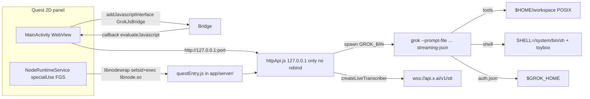

# Grok Desktop on Meta Quest 3 — Design Document

| Field | Value |
|-------|-------|
| **Title** | Port Grok Desktop to a native Quest 3 Android app |
| **Author** | Grok Design |
| **Date** | 2026-08-30 |
| **Status** | Draft |
| **Revision** | 5 (token-budget / review cut) |
| **Workspace** | `E:\Dev\GrokDesktopAndroid` |
| **GitHub** | https://github.com/dcasselwork123/GrokDesktopAndroidApp |
| **Source of truth for UI/server** | `E:\Dev\GrokDesktop` (not rewritten in place) |
| **Target device** | Meta Quest 3, Horizon OS, arm64-v8a, sideload APK |

---

## Overview

Grok Desktop is a Claude Desktop–style Electron app: a vanilla `renderer/` talks HTTP/SSE to `server/httpApi.js`, which spawns the **Grok Build CLI** (`grok --prompt-file … --output-format streaming-json`) against `~/.grok/sessions`. This document specifies a **new Android app** that preserves that architecture on Quest 3 as a **2D floating panel**, with an on-headset **standalone Node executable** and a bundled grok CLI. Remote/phone control (Tailscale, `?token=`, LAN bind, 📱 UI) is explicitly out of scope. Primary input is **push-to-talk dictation plus spoken slash commands**.

v1 is not Unity/OpenXR and not a Compose rewrite of chat. A Kotlin shell hosts a WebView pointed at `http://127.0.0.1:<port>/`, starts and supervises the existing Node HTTP server as a local process, and replaces Electron-only IPC (`pick-folder`, side-chat windows, `openExternal`) with Android equivalents. The whole port is gated on a **feasibility spike** with a concrete pass/fail matrix: a **standalone Node executable** in `nativeLibraryDir` must `http.createServer` **and** `child_process.spawn(GROK_BIN)`. nodejs-mobile-in-process is not a spare life — its `child_process` module is unsupported.

---

## Background & Motivation

### Current desktop architecture

```
UI (Electron BrowserWindow or Safari)
  → GET /api/setup  (CLI installed? auth.json valid?)
  → POST /api/auth/login → spawn grok login --oauth   (desktop)
  → HTTP/SSE  server/httpApi.js
       → save images → ~/.grok-desktop/uploads/
       → live STT via createLiveTranscriber → wss://api.x.ai/v1/stt
            (sample_rate=16000, encoding=pcm, interim_results=true,
             smart_turn=0.7, smart_turn_timeout=3000, endpointing=400,
             vad_threshold=0.05)
       → spawn grok --prompt-file … --verbatim -m … --effort … --permission-mode …
                --output-format streaming-json --cwd … [--resume id]
       → sessions  ~/.grok/sessions/<cwd-group>/<id>/
```

Canonical map: `E:\Dev\GrokDesktop\AGENTS.md`. Server entry: `server/index.js` → `createServer()` in `server/httpApi.js`. Spawn and session logic: `server/grokService.js` (`resolveGrokBinary`, `runPrompt`, `buildArgs`, `getSetupStatus`, `startGrokLogin`). ACP continuation: `server/grokAcp.js` `buildAcpArgs` (`--no-auto-update agent [--always-approve] stdio`). Renderer: `renderer/index.html`, `app.js`, `styles.css`. Electron shell: `electron/main.js` + `preload.js` (`window.grokDesktop`).

`package.json` declares `"engines": { "node": ">=18" }` and **zero runtime npm dependencies**. The HTTP API is stdlib-only (`http`/`https`/`fs`/`child_process`/…). Electron is a `devDependency` used as the window host. Live STT (`server/speechToText.js` `getWebSocketImpl`) needs a `WebSocket` constructor: global `WebSocket` (Node 21+ / Electron 35) or optional `require("undici")`. Quest Node must be **≥ 21** (prefer 22) so we do not vendor undici.

Port bind: `createServer` in `httpApi.js` listens **once** on `127.0.0.1` then **always** `await rebind()` (Tailscale/LAN extras). Port retries (`3847, +1, +2, 0`) live only in `electron/main.js`. `server/index.js` has **no** retry and starts a 20s `api.rebind()` poll. Quest must overlay a `questEntry.js` (see API overlay). `guessDefaultCwd()` in `app.js` returns `state.sessions[0]?.cwd` or `""`; empty cwd makes `POST /api/chat` use `process.cwd()`.

Desktop login: `startGrokLogin` spawns `grok login --oauth` (or `grok login` if `oauth: false`). `method: "x"|"email"` is stored in `loginState` only — **not** passed as CLI flags. `getLoginStatus().logTail` is the last **1200** chars of an 8000-char ring.

### Pain points this port exists to solve

- The headset is the computer. A PC sidecar plus phone remote is the current remote model (`server/remoteAccess.js`); the user has locked **on-headset grok CLI**, no sidecar, no Tailscale.
- Quest input is voice-first. Desktop already has Claude-style PTT (`#btn-mic`, no auto-send). Spoken slash commands (`/new`, `/clear`, `/imagine`, Stop, …) are new.
- Electron `dialog.showOpenDialog` / IPC `pick-folder` has no Quest equivalent; Android Storage Access Framework (SAF) and app-private POSIX trees must replace it without breaking grok tools that require real filesystem paths.

### What Quest 3 actually is

Horizon OS is AOSP. A 2D Android app renders as a **floating, resizable panel** in passthrough/home; the shell maps controller/hand pointing to Android touch/click. This is Meta’s documented productivity-app pattern ([Create a new app](https://developers.meta.com/horizon/documentation/android-apps/create-app/), [Panel sizing](https://developers.meta.com/horizon/essentials/horizon-os-panel-sizing/)). **All Horizon OS releases since v76 (April 2025) use Android 14 (API 34).** v1 uses a 2D panel. Immersive 3D is a later PR.

---

## Goals & Non-Goals

### Goals (v1)

- Sideloadable `arm64-v8a` APK that launches as a Quest 2D panel.
- Same Grok account via **`grok login --device-auth`** on device; **separate** session store (not synced with PC `~/.grok/sessions`).
- Full agent/tool parity including `shell`, working-folder picker, Full access / Safer (`bypassPermissions` / `dontAsk`), first-seen-folder warning.
- Chat UI: markdown, tool chips, background turns, queue, stop, `ask_user_question` cards + ACP stdio continue (`server/grokAcp.js`).
- `/` menu: New, Clear, Side chat, Imagine, Export, Help. `/btw` as an in-app overlay WebView (not a second Electron window).
- Images: attach max 8 JPEG re-encode; generated `images/` `videos/` via `GET /api/sessions/:id/media/…`.
- PTT dictation (live STT + batch fallback) **and** spoken slash commands. Dictation does not auto-send.
- Theme light/dark/system. Model / effort selectors. Weekly usage pie.
- Bind **127.0.0.1 only**. No remote sockets, no Tailscale poll, no 📱 UI.

### Non-goals (v1)

- Immersive 3D / Unity / OpenXR / Spatial SDK scene.
- Rewrite of `renderer/` in Compose or React.
- xAI HTTP chat APIs as the primary execution path.
- PC sidecar, Tailscale, phone token UX, `GROK_DESKTOP_TOKEN` as a user-facing secret, Allow LAN, 📱 UI.
- Horizon Store / App Lab listing.
- Syncing sessions with the PC app.
- Debian / full-Linux proot userspace (bionic grok-build comes first if musl DNS fails; proot is last-resort DNS only).
- In-APK `git pull` updates (desktop `server/appUpdate.js` is git-based; wrong for an APK).
- nodejs-mobile-in-process as a Node host (no `child_process`).
- Kotlin-only grok supervisor that replaces `httpApi.js` (true backup if Node exec fails — not v1).

---

## Proposed Design

### Architecture



Data flow is the desktop one-liner, with Electron replaced by WebView+Kotlin and `os.homedir()` replaced by an app-private `HOME`.

### Process model

| Process | Role | Lifecycle |
|---------|------|-----------|
| App UI (`:ui`) | `MainActivity` + WebView + `GrokJsBridge` | Standard activity. `onStop` does **not** stop the FGS. After process death, rebind WebView to the **new** port from `runtime.json`. |
| Runtime (`:runtime`) | `NodeRuntimeService` | `foregroundServiceType="specialUse"`. `ProcessBuilder` exec of vendored Node **executable** (`libnode.so`). Single instance via pid file. |
| grok children | Spawned by Node `child_process.spawn` from `runPrompt` / `startGrokLogin` / `createAcpClient` | **Same process group as Node** (non-detached spawn). Service `Os.kill(-nodePid)` kills the group. **Not** a new process group. |

#### Foreground service (not `dataSync`)

`dataSync` is a short data-transfer type. Android 15 (API 35) caps it at **6 hours / 24h** then `Service.onTimeout`. Horizon OS is already API 34 (v76+) and will move. Sideload v1 uses **`specialUse`**:

```xml
<uses-permission android:name="android.permission.FOREGROUND_SERVICE" />
<uses-permission android:name="android.permission.FOREGROUND_SERVICE_SPECIAL_USE" />
<uses-permission android:name="android.permission.POST_NOTIFICATIONS" />
<uses-permission android:name="android.permission.WAKE_LOCK" />

<service
    android:name=".NodeRuntimeService"
    android:exported="false"
    android:foregroundServiceType="specialUse"
    android:process=":runtime">
  <property
      android:name="android.app.PROPERTY_SPECIAL_USE_FGS_SUBTYPE"
      android:value="On-device Grok CLI agent and local 127.0.0.1 HTTP server; must outlive panel pause and headset doff." />
</service>
```

Required behavior:

| Rule | Spec |
|------|------|
| Notification | Channel `grok-runtime`, ongoing, title `Grok Desktop`, text `Runtime on 127.0.0.1:<port>` (or `Starting…`). Not a silent FGS. |
| `POST_NOTIFICATIONS` | Runtime prompt on API 33+ **before** `startForegroundService`. If denied, refuse to start the agent and show setup copy. |
| `startForeground()` | Called within 10s of `startForegroundService`. |
| Single Node | Pid file `$HOME/.grok-desktop/node.pid`. If pid alive and `runtime.json` port answers `/api/health`, do not spawn a second Node. `START_STICKY` with null intent: re-read pid/`runtime.json`; spawn only if dead. |
| Process-group kill | **Node** is the group leader, not grok. A tiny native wrapper `libnodewrap.so` calls `setsid()` then `execv(libnode.so, …)` so the ProcessBuilder pid **is** Node’s pid **and** pgid. Grok spawn stays **non-detached** (`stdio` pipes as today) so `shell` / subagents stay in Node’s group. Service stop: `android.system.Os.kill(-nodePid, SIGTERM)` then SIGKILL after 3s. **Do not** `spawn({ detached: true })` — that puts grok in a *new* group that `kill(-nodePid)` misses. **Do not** use `Process.killProcess` (not a group kill). Desktop `killChildTree` remains `proc.kill("SIGTERM")` on the direct child only. |
| Wake lock | `PARTIAL_WAKE_LOCK` while a chat run is live. `NodeRuntimeService` **GET** `http://127.0.0.1:<port>/api/runs` every **5s** (loopback; no token on Quest). Acquire if any run is live; release after 60s idle. **No `run.lock` file.** |
| Doff / idle | PR 1 **must** start Node, take the headset off, wait ≥ 60s, confirm the Node pid still exists. |
| After FGS restart | In-flight grok children of the **old** Node are dead. Renderer reconnect to `/api/chat/runs/:id` finds nothing → existing reconnect banner; copy: “Turn died; session is on disk.” |

### Bundled Node + grok CLI (the hard path)

Two **different** binaries, both ARM64:

1. **Node** — a **standalone executable** that runs `overlay/server/questEntry.js`. Not the agent. Not a JNI `dlopen` library.
2. **grok** — official Grok Build CLI. Rust. **Not** an npm/Node program. Desktop resolves it via `GROK_BIN`, `~/.grok/bin/grok(.exe)`, `~/.local/bin/grok`, then PATH (`resolveGrokBinary()`).

Do **not** conflate (1) a Node **executable** renamed `libnode.so` (valid W^X packaging) with (2) nodejs-mobile’s JNI `libnode.so` (`System.loadLibrary("node")` + `node::Start()`). Exec of (2) is typically `ENOEXEC`. Official nodejs-mobile docs: **`child_process` and `cluster` are unsupported**. `runPrompt` / `startGrokLogin` / ACP are `child_process.spawn(GROK_BIN)`. Therefore **nodejs-mobile-in-process cannot host `httpApi.js` as written** and is **not a fallback**.

#### Android W^X (targetSdk 34)

Apps targeting API 29+ **cannot `exec()` from `filesDir`**. Place executables in `app/src/main/jniLibs/arm64-v8a/` named `lib*.so`, `android:extractNativeLibs="true"`, Gradle `packaging { jniLibs { useLegacyPackaging.set(true) } }`, exec from `applicationInfo.nativeLibraryDir`.

**v1 vendors binaries in the APK.** First-run download of grok into `filesDir` is not an execute path.

| APK native lib | Kind | Source |
|----------------|------|--------|
| `libnode.so` | **ET_DYN PIE executable** with program interpreter (not a JNI shared object) | NDK-built Node 22 (primary); Termux `node` + deps (fallback prebuilt) |
| `libnodewrap.so` | Tiny PIE: `setsid()` then `execv(libnode.so, …)` | Same NDK r26c / API 32 / `-Wl,-z,max-page-size=16384` as Node. Required. Not optional. |
| `libc++_shared.so` | NDK STL | Shipped next to Node; `LD_LIBRARY_PATH=nativeLibraryDir` |
| `libgrok.so` | grok CLI executable | Official `linux-aarch64` musl artifact renamed; or bionic `xai-org/grok-build` if DNS/TLS requires it |
| `libbusybox.so` | **optional**, not on PATH as applets | Only if PR 1 proves `libbusybox.so ash -c 'type wget'` and we set `SHELL=` to that binary |

Wrappers: Kotlin starts **`libnodewrap.so`** (setsid + exec) with argv `libnode.so`, `<filesDir>/app/server/questEntry.js`. Set `GROK_BIN=<nativeLibraryDir>/libgrok.so`. Do not rely on `#!/usr/bin/env node`. Do not `ProcessBuilder` Node directly (no `setsid` → `kill(-nodePid)` is `ESRCH` or hits the JVM group).

#### How `libnode.so` is obtained (required before PR 1)

**Primary — NDK-built Node 22 executable (repo-owned recipe in `scripts/fetch-runtime.ps1`):**

Android is unofficial but upstream documents it. **Re-verify against the `v22.14.0` tag** of `android-configure` / `android_configure.py`, not `main`. Node 22 + NDK r27 has known breakage ([nodejs/node#58505](https://github.com/nodejs/node/issues/58505)); **pin NDK r26c**.

v22.14.0 `android_configure.py` usage is:

```text
./android-configure <NDK path> <Android SDK version> <arch>
```

It **executes** (Python, via the `android-configure` sh/python shim) — it is **not** sourced. It requires **Linux or Darwin** (`sys.exit` on Windows). WSL2 counts as Linux; native Windows Gradle **consumes** a CI/WSL artifact. SDK version must be **≥ 24** (`int(sys.argv[2])`); we pass **32** (minSdk). Arch `arm64` or `aarch64`.

The script then runs **exactly**:

```text
./configure --dest-cpu=arm64 --dest-os=android --openssl-no-asm --cross-compiling
```

No `--without-snapshot` (suppressed dummy on Node 22). `--with-intl=small-icu` is **not** in that line. `fetch-runtime.ps1` **patches** the `os.system("./configure …")` call in `android_configure.py` to append ` --with-intl=small-icu` **before** invoking the script.

```text
Host: Linux or Darwin (WSL2 OK). Not native Windows.
NDK: r26c
SDK version argument: 32
Arch: arm64

git clone --depth 1 --branch v22.14.0 https://github.com/nodejs/node.git
# patch android_configure.py configure line to append --with-intl=small-icu
./android-configure "$NDK_PATH" 32 arm64
make -j$(nproc)
# Artifact: out/Release/node   (PIE executable)
# Copy as app/src/main/jniLibs/arm64-v8a/libnode.so
# Copy NDK libc++_shared.so beside it
# Ship libnodewrap.so (setsid + execv) built with the same NDK, API 32, max-page-size 16384
```

Wrong invocation `source ./android-configure $NDK_PATH arm64 32` parses SDK version as `arm64` (`int("arm64")` throws) and must not appear in the script.

Runtime env: `LD_LIBRARY_PATH=<nativeLibraryDir>` (needed for `libc++_shared.so`; `System.loadLibrary` is **not** used — we `exec` Node).

**Fallback prebuilt — Termux `nodejs` + `.so` deps** (same `jniLibs` layout, faster calibration):

- Unpack Termux aarch64 `nodejs` + `libicu`, `libuv`, `openssl`, `libnghttp2`, `zlib`, `c++_shared` `.deb`/bootstrap.
- `patchelf --set-rpath '$ORIGIN'` on `node` and every dependent `.so`.
- Rename `node` → `libnode.so`. Exec with `LD_LIBRARY_PATH=nativeLibraryDir`.
- If ICU data is a separate file, ship it under `filesDir` and set `NODE_ICU_DATA`.

`fetch-runtime.ps1` tries Termux tarball **only as a developer shortcut** if `vendor/termux-node/` is present; CI and the documented v1 binary are the NDK recipe. Spike `readelf -l libnode.so` **must** show `Type: DYN (Shared object file)` **and** a program interpreter (`[Requesting program interpreter: /system/bin/linker64]`). A JNI-only `libnode.so` (no interpreter, `NEEDED libdl` + exported `node::Start`) is **the wrong artifact** — fail the spike.

If **neither** the NDK Node executable nor the Termux-prebuilt executable can `http.createServer` + `spawn(grok)` from `nativeLibraryDir`, **the port is blocked**. The true backup (Kotlin `ProcessBuilder` for grok **and** a rewritten `runPrompt`) is not v1.

#### Kotlin supervision

```kotlin
val wrap = File(applicationInfo.nativeLibraryDir, "libnodewrap.so") // setsid(); execv(argv[1], argv+1)
val node = File(applicationInfo.nativeLibraryDir, "libnode.so")
val grok = File(applicationInfo.nativeLibraryDir, "libgrok.so")
val home = File(filesDir, "home").apply { mkdirs() }
val workspace = File(home, "workspace").apply { mkdirs() }
val tmp = File(filesDir, "tmp").apply { mkdirs() }
val appJs = File(filesDir, "app") // extracted: app/server/*, app/renderer/*

// Layout: app/server/questEntry.js next to copied httpApi.js
// staticDir inside questEntry = path.join(__dirname, "..", "renderer")  // same as server/index.js
ProcessBuilder(
    wrap.absolutePath,
    node.absolutePath,
    File(appJs, "server/questEntry.js").absolutePath,
).apply {
    directory(appJs) // Node module root; DEFAULT GROK CWD IS NOT THIS
    redirectErrorStream(true)
    environment().apply {
        put("HOME", home.absolutePath)
        put("TMPDIR", tmp.absolutePath)
        put("GROK_HOME", File(home, ".grok").absolutePath)
        put("GROK_BIN", grok.absolutePath)
        put("GROK_QUEST_WORKSPACE", workspace.absolutePath)
        put("GROK_DESKTOP_HOST", "127.0.0.1")
        put("GROK_DESKTOP_PORT", "3847")
        put("GROK_DESKTOP_ALLOW_LAN", "0")
        put("SHELL", "/system/bin/sh")
        put("PATH", "/system/bin:/system/xbin")
        put("LD_LIBRARY_PATH", applicationInfo.nativeLibraryDir)
        put("TERM", "xterm-256color")
    }
}
```

`libnodewrap.so` (~20 lines of C, NDK API 32, `-fPIE -pie -Wl,-z,max-page-size=16384`): `setsid()` (ignore `EPERM` if already session leader) then `execv(argv[1], argv + 1)`. After exec, the Java `Process` pid is Node, and that pid is the process-group id. Grok children inherit it.

Port retries, `runtime.json`, and **no `rebind()`** live in `overlay/server/questEntry.js`, not in this sketch. `GROK_DESKTOP_PORT=3847` is a hint; the entry retries 3847, +1, +2, then 0 (same as `electron/main.js` `portsToTry`). Handshake file `$HOME/.grok-desktop/runtime.json` `{ port, pid, startedAt, grokBin }` is **required** (not log scraping). Electron prints `Local UI: http://127.0.0.1:<port>`; stock `index.js` prints `Grok Desktop server` / `Local:` — do not parse either.

On first extract, seed `$HOME/.grok-desktop/config.json` `lastCwd` to `$HOME/workspace` (create the directory). Do **not** leave lastCwd unset so `body.cwd || process.cwd()` becomes the extracted JS tree.

#### Honest feasibility (PR 1 pass/fail)

Commit this table as `SPIKE.md`. Name the exact binaries (NDK `out/Release/node` renamed vs Termux `node` renamed vs JNI lib — JNI is automatic **fail**).

| Check | Pass | Else |
|-------|------|------|
| `readelf -l libnode.so` is ET_DYN **PIE executable** with `/system/bin/linker64` interpreter | GO | Wrong artifact (JNI lib). NO-GO for that file. |
| `exec` `libnode.so --version` from `nativeLibraryDir` | GO path | NO-GO — port blocked |
| Control: copy same binary to `filesDir` and `exec` | **must** fail `EACCES` | We do not understand W^X |
| Node `http.createServer` bind `127.0.0.1:0` | required | NO-GO |
| Node `spawn(process.env.GROK_BIN, ["--version"])` exit 0 | required | NO-GO |
| `libgrok.so --version` from `nativeLibraryDir` | required | try bionic rebuild (B) |
| `ls -l /bin/sh /system/bin/sh`; `echo $SHELL` | note | set `SHELL=/system/bin/sh` |
| `/etc/resolv.conf` contains a nameserver | note | expect musl DNS fail |
| grok `getaddrinfo api.x.ai` (or `grok --version` then a tiny net probe) | primary musl OK | fallback B **bionic grok-build** (same APK `libgrok.so`). No `/sdcard` 16-byte patch |
| TLS `https://api.x.ai` from grok (CLI bundles rustls roots — verify) | required for login/chat | report CA; do not assume Android `/apex/.../cacerts` |
| `readelf -l` 16 KiB LOAD alignment | note (future API 35) | not a v1 blocker |
| FGS doff: Node pid alive after 60s headset-off | required for v1 lifecycle | fix FGS type/wake lock before chat |
| `grok -p hi` | **not PR 1** | needs `auth.json` (PR 4+) |

**Go/no-go:** standalone Node executable in `nativeLibraryDir` can `http.createServer` **and** `spawn(GROK_BIN)`. If that exec fails, the port is blocked. A musl grok that prints `--version` but cannot resolve `api.x.ai` is **GO with fallback B (bionic grok-build in the same APK slot)**, not a silent pass and not a NO-GO.

#### Musl DNS / TLS sequence (not proot-first, not `/sdcard`)

Community Termux ports: official `linux-aarch64` is a **statically linked musl** binary that **does** exec on Android, **bundles TLS roots**, and fails DNS **only** because musl hardcodes `/etc/resolv.conf` (16 bytes; often missing or empty; `/etc` → `/system/etc`). Their `/sdcard/.grokdns` patch is a **Termux** trick (`termux-setup-storage` / legacy shared storage). **This APK cannot use it:** targetSdk 34, no `MANAGE_EXTERNAL_STORAGE`, scoped storage — a normal UID cannot create `/sdcard/.grokdns`. No app-private path is 16 bytes (`/data/data/dev.grokdesktop.quest/…` is far longer). **v1 does not ship a 16-byte resolv patch.** Termux’s patch is a footnote only.

1. Unmodified musl grok + real `/etc/resolv.conf` nameserver on Horizon (PR 1 row). If DNS works, keep musl `libgrok.so`.
2. If DNS-only failure: **fallback B = bionic `xai-org/grok-build`**, same APK slot `libgrok.so`. Recipe (repo-owned, `fetch-runtime.ps1`):
   ```text
   Host: Linux or Darwin (WSL2 OK)
   NDK: r26c
   Target: aarch64-linux-android
   API: 32
   rustup target add aarch64-linux-android
   export ANDROID_NDK_HOME=$NDK_PATH
   LINKER=$NDK/toolchains/llvm/prebuilt/<host>/bin/aarch64-linux-android32-clang
   export CARGO_TARGET_AARCH64_LINUX_ANDROID_LINKER=$LINKER
   export TARGET_CC=$LINKER
   export RUSTFLAGS="-C link-arg=-pie -C link-arg=-Wl,-z,max-page-size=16384"
   git clone --depth 1 https://github.com/xai-org/grok-build.git
   cargo build --release --target aarch64-linux-android
   # Artifact: target/aarch64-linux-android/release/grok  (PIE, bionic getaddrinfo)
   # Copy as app/src/main/jniLibs/arm64-v8a/libgrok.so
   # readelf -l: ET_DYN + interpreter /system/bin/linker64
   ```
   Pin the grok-build commit in `SOURCE_REV` / `fetch-runtime.ps1`. If the crate name is not `grok`, copy the actual binary the package emits (`grok` / `agent`).
3. proot bind-mount of resolv is **last** and is not a Debian userspace. Not a PR 1 GO path.

Do not imply HTTPS is unsolved for grok if the musl binary already ships rustls roots; still **verify** the TLS row on device. Bionic grok uses Android `/apex/.../cacerts` via bionic — verify TLS on that artifact too.

### Filesystem + `GROK_HOME`

`getGrokHome()` is `process.env.GROK_HOME || path.join(os.homedir(), ".grok")`. `getDesktopHome()` is `path.join(os.homedir(), ".grok-desktop")`. **Setting `HOME` is mandatory.**

| Logical path | Android location | Notes |
|--------------|------------------|-------|
| `$HOME` | `/data/data/dev.grokdesktop.quest/files/home` | `os.homedir()` |
| `$GROK_HOME` | `$HOME/.grok` | `auth.json`, `sessions/` |
| Desktop config | `$HOME/.grok-desktop/config.json` | `permissionMode`, `seenFolders`, `lastCwd` (seeded to workspace), `theme`. Unmodified `resolveAccessSettings()` still mints `token` into this file — unused on loopback; overlay does not surface it. |
| Uploads / prompts | `$HOME/.grok-desktop/uploads/`, `prompts/` | `saveImageUpload`, `writeTempPromptFile` |
| **Default grok cwd** | `$HOME/workspace` | Created on first run. Seed `lastCwd`. Renderer overlay: empty cwd → workspace, **never** `process.cwd()`. |
| Named projects | `$HOME/projects/<name>` | POSIX picker “New folder” |
| User-visible copy | `getExternalFilesDir(null)/projects/` | MTP-visible, still app-scoped |
| Runtime extract | `filesDir/app/server/*` and `filesDir/app/renderer/*` | Copied from APK assets on version bump. **`questEntry.js` lives at `filesDir/app/server/questEntry.js`** next to copied `httpApi.js`. Node `directory()` is `filesDir/app`; grok cwd is **not**. |

**One layout (do not mix):**

| Path | Role |
|------|------|
| `filesDir/app/server/questEntry.js` | Process entry (overlay). ProcessBuilder argv. |
| `filesDir/app/server/httpApi.js` | Patched copy |
| `filesDir/app/renderer/` | Static UI |
| `staticDir` | `path.join(__dirname, "..", "renderer")` — **same as stock `server/index.js`**. `__dirname` is `…/app/server`, so UI is `…/app/renderer`. |

Do **not** put `questEntry.js` at `filesDir/app/questEntry.js` (then `__dirname/renderer` or `__dirname/../renderer` disagrees with ProcessBuilder). Do not use `path.join(__dirname, "renderer")` (that would be `server/renderer` and 404 the WebView).

`questEntry.js` does **not** `chdir` to workspace. Default grok cwd is enforced in the **`httpApi.js` overlay** (empty `body.cwd` → `getLastCwd() \|\| GROK_QUEST_WORKSPACE`) plus renderer `__grokQuestWorkspace`. Seed `lastCwd` on first run.

#### Working-folder picker

Desktop: `browseFolderDesktop()` `await window.grokDesktop.pickFolder(...)` (Promise from `ipcRenderer.invoke`). Quest injects the same Promise API via a **callback protocol** (see JS bridge) so `isElectron()` is true and `isPhoneUi()` is false.

Quest cannot feed grok a `content://` tree.

1. **Recommended:** pick among POSIX dirs we own (`workspace`, `projects/*`, `externalFilesDir/projects/*`). “Create project” mkdir.
2. **SAF import (v1 = one-shot snapshot):** user picks a document tree; we copy into `$HOME/projects/<sanitizedDisplayName>`. **No write-back.** **No incremental sync** (later PR). Caps: **5000 files or 2 GB**, whichever first — hard fail with a dialog, partial copy deleted. Progress sheet with cancel (abort walk, delete dest). **Do** copy `.git` if present (it is just files). Full access + `shell` can `rm -rf` **the copy only**, not the SAF source. Picking a 40 GB photo tree hits the 2 GB cap and fails cleanly.

First-seen: `getSeenFolders` / `addSeenFolder`; a newly created or imported project dir is first-seen. Folder change still starts a new draft when cwd ≠ open session cwd.

### Shell / tools story

Grok tools run **inside grok** against `--cwd`. `buildArgs()`:

```text
--permission-mode bypassPermissions   # Full access (desktop default)
--permission-mode dontAsk             # Safer
```

Quest overlay also appends **`--no-auto-update`** to `buildArgs()` (today only `buildAcpArgs` in `grokAcp.js` has it). Keep `GROK_BIN` pointed at `libgrok.so` so a CLI self-update into `$GROK_HOME/bin` is never exec’d.

**v1 shell is not “busybox on PATH.”** `nativeLibraryDir` contains `libbusybox.so`, not `wget`. Grok `shell` runs `sh -c "wget …"`; PATH lookup is the name `wget`. You cannot install applet symlinks into `nativeLibraryDir`. Wrapper scripts under `filesDir` fail W^X.

| Component | v1 |
|-----------|-----|
| `SHELL` | `/system/bin/sh` (mksh). Spike `ls -l /bin/sh /system/bin/sh` — many CLIs hardcode `/bin/sh`; on Android that is often a symlink to toybox/mksh. |
| `PATH` | `/system/bin:/system/xbin` **first**. Do **not** prepend `nativeLibraryDir`. |
| Coreutils | **toybox** on `/system/bin` |
| cwd | POSIX working folder (`$HOME/workspace` default) |
| uid | app UID. **No root.** |

Commands expected via toybox: `ls`, `cat`, `cp`, `mv`, `rm`, `mkdir`, `chmod`, `ln`, `touch`, `echo`, `printf`, `pwd`, `env`, `grep`, `sed`, `tr`, `cut`, `head`, `tail`, `wc`, `sort`, `find`, `xargs`, `tar`, `gzip`, `base64`, `sha256sum`, `date`, `sleep`, `ps`, `kill`, `uname`, `df`, `du`. **Not** expected: `git`, `python`, `gcc`, `npm`, `apt`, `docker`, `sudo`, `wget`/`diff` unless the spike shows toybox provides them or we opt into busybox-as-SHELL.

**Optional busybox (only if PR 1 proves it):** if `libbusybox.so` is a standalone-applet busybox (`busybox ash -c 'type wget'` works when `SHELL=<nativeLibraryDir>/libbusybox.so`), set `SHELL` to that binary. Applets then resolve **inside** busybox, not via PATH. Do not claim PATH prepend equals a userspace.

PR 1/PR 3 own `SHELL`/`PATH`. Full access turns in PR 5 will already call `shell` — do not wait for a later “busybox PR”.

### WebView + existing renderer

**Load `http://127.0.0.1:<boundPort>/`**, same as Electron `mainWindow.loadURL(api.url)`. Do not `file:///android_asset`: CSP `connect-src 'self'`, SSE, STT, and `/api/sessions/:id/media` need the API origin.

`http://127.0.0.1` is a Chromium **secure context**, so `liveVoiceSupported()` *can* be true. Mixed-content mode is **irrelevant** for an http document talking to itself — do not depend on it.

#### WebSettings

| Setting | Value |
|---------|-------|
| `javaScriptEnabled` | true |
| `domStorageEnabled` | true |
| `mediaPlaybackRequiresUserGesture` | false |
| `allowFileAccess` | **false** |
| `mixedContentMode` | default (unused) |
| `setSupportMultipleWindows` | true **only** as fallback for `window.open`; primary `/btw` is `openSidechat` overlay |

Network security config: `usesCleartextTraffic=false`; cleartext **only** for `127.0.0.1` and `localhost`. This applies to **our** app. The Meta browser / Custom Tabs is a **different** app — it does not use our NSC. That is why device-code (https:// grok.com) is the login primary, not a loopback OAuth callback in the system browser.

#### Mic permission algorithm

1. Manifest `RECORD_AUDIO` + `MODIFY_AUDIO_SETTINGS`.
2. Before first PTT: native runtime `requestPermissions(RECORD_AUDIO)`.
3. `WebChromeClient.onPermissionRequest`: if origin is the loopback API origin **and** `RECORD_AUDIO` is granted **and** resources contain `RESOURCE_AUDIO_CAPTURE`, `grant(arrayOf(RESOURCE_AUDIO_CAPTURE))` only. Else `deny()`. Default `WebChromeClient` denies getUserMedia — we must override.
4. If WebView `getUserMedia` fails on hardware: `AudioRecord` 16 kHz mono PCM16 ~100 ms frames → existing `POST /api/stt/audio`. JS owns PTT via the bridge.

SSE `EventSource` to same origin should work. If the **activity** is destroyed, EventSource dies; `app.js` already reconnects `/api/chat/runs/:id`. If **Node** died, the run is gone (FGS section).

`shouldOverrideUrlLoading`: allow `isApiOrigin` (port from handshake); `http(s)` → Custom Tabs via `isSafeExternalUrl`. Mirrors `attachCommonWindowHandlers`.

#### JS bridge (not a drop-in for `ipcRenderer.invoke`)

`@JavascriptInterface` methods are **synchronous** on the WebView thread. Returning a Kotlin Promise does not work. Blocking that thread on a folder dialog freezes the page.

Install:

```kotlin
webView.addJavascriptInterface(GrokJsBridge(this), "GrokAndroid")
// Inject after page start; restrict conceptually to loopback origin
// (WebView only loads 127.0.0.1). API 17+ @JavascriptInterface on public methods.
```

Injected preload (evaluateJavascript on `onPageStarted`):

```js
(function () {
  const pending = new Map();
  function call(method, args) {
    const id = String(Date.now()) + "-" + Math.random().toString(16).slice(2);
    return new Promise((resolve, reject) => {
      pending.set(id, { resolve, reject });
      GrokAndroid[method](id, JSON.stringify(args || {}));
    });
  }
  window.grokDesktop = {
    isElectron: true,
    isQuest: true,
    __resolve: function (id, err, value) {
      const p = pending.get(id);
      if (!p) return;
      pending.delete(id);
      if (err) p.reject(new Error(err));
      else p.resolve(value);
    },
    getApiInfo: () => Promise.resolve({ url: location.origin, port: Number(location.port) }),
    pickFolder: (defaultPath) => call("pickFolder", { defaultPath: defaultPath || "" }),
    setTheme: (pref) => call("setTheme", { pref: pref }),
    openSidechat: (payload) => call("openSidechat", payload || {}),
    getSidechatInit: (nonce) => call("getSidechatInit", { nonce: nonce }),
    startPtt: () => call("startPtt", {}),
    stopPtt: () => call("stopPtt", {}),
  };
})();
```

Native completion: `webView.evaluateJavascript("grokDesktop.__resolve(" + JSON.stringify(id) + ", null, " + JSON.stringify(pathOrNull) + ")", null)` on the UI thread.

`openSidechat` **primary** = overlay WebView (same as Electron IPC, not `window.open`). Keep `onCreateWindow` only as fallback; Electron denies popups and uses IPC.

Quest overlay on renderer:

- If `grokDesktop.isQuest`: hide `#btn-remote-info`; **skip** `loadRemoteInfo()` / `api("/api/remote")` (today ~6445 in `app.js`); skip rotate-token modal and LAN checkbox.
- Empty cwd → `$HOME/workspace` (injected as `window.__grokQuestWorkspace`).
- Spoken-command module + command chip DOM.
- CSS: min tap target 48dp. Default panel 1280×840 (Electron `windowPrefs`). Min 640×400 so the user **can** shrink below 800dp and hit the existing `@media (max-width: 800px)` sidebar-scrim — that is intentional, not `phone-ui` (still `isElectron`).

### Voice: PTT + spoken slash commands

Reuse `server/speechToText.js` `createLiveTranscriber` / `buildSttWsUrl` (full query: `sample_rate=16000`, `encoding=pcm`, `interim_results=true`, `smart_turn=0.7`, `smart_turn_timeout=3000`, `endpointing=400`, `vad_threshold=0.05`). Fallback `POST /api/stt`. Auth `getAccountAccessKey()`. UI: `#btn-mic` click to start/stop; **does not auto-send**.

**Match spoken commands only on PTT stop** (mic returns to idle), **not** on live `speech_final`. `applyLiveTranscript` can emit `speech_final` **during** a hold; matching then would fire `/new` mid-dictation. The visible Stop control (existing `#btn-stop`) always calls `interruptCurrentTurn()` — it is **not** a spoken command and works while dictating.

Live STT events in this codebase have **no confidence field**. Do not filter on confidence.

English-only v1. Chip DOM (overlay; does not exist in desktop `renderer/`): `#voice-command-chip` in the composer, `aria-live="polite"`, text `Command: New chat`, visible 1.5s. On command success the composer is **unchanged** (still empty or still whatever dictation had not been committed). Undo is “do nothing”.

Explicit ordered grammar (first match wins). Whole utterance, anchored, after `trim` + collapse whitespace + case-fold. Max 8 words unless noted.

| Order | Pattern (JS) | Action | Max words |
|-------|----------------|--------|-----------|
| 1 | `/^(new chat|new session|start over|start a new chat)$/` | `handleSlashCommand("/new")` | 5 |
| 2 | `/^(clear chat|wipe this chat|clear this chat)$/` | `/clear` | 4 |
| 3 | `/^(export chat|download transcript|export this chat)$/` | `/export` | 4 |
| 4 | `/^(help|show commands|show help)$/` | `/help` | 3 |
| 5 | `/^(side chat)$/` | `/btw` | 2 |
| 6 | `/^(by the way)\b(.*)$/` | `/btw $2`.trim() | 8 |
| 7 | `/^(imagine|generate an image of|generate a picture of)\b(.*)$/` | `/imagine $2`.trim() (empty rest → insert `/imagine `) | 8+ for rest |
| 8 | `/^(stop grok|stop the turn)$/` | `interruptCurrentTurn()` | 4 |

**Not matched:** bare `stop`, `cancel`, `send`, `submit`. “don’t stop the build” is dictation. “imagine a cat” matches row 7 (verb-first). “I imagine a cat would …” does not (no anchor match). If already composing `/imagine `, skip the matcher.

Ship this table next to `SLASH_COMMANDS` in the overlay `app.js`.

### Identity, OAuth, sessions

Same xAI/Grok account; **device-local** `auth.json`. No Tailscale, no phone token UX.

**v1 primary login is `grok login --device-auth` (device-code / `--device-code`).** Official grok-build docs document this for headless environments: print verification URL + user code, CLI polls, **no loopback redirect**. Quest Browser / Custom Tabs is a second app; **our** `network_security_config` does not apply to it; cleartext `http://127.0.0.1:<random>/callback` is likely blocked there.

Overlay `startGrokLogin` via **in-place patch** of `grokService.js` (it is exported, but `httpApi.js` **destructures at load** — wrapping after `require("./httpApi")` is a no-op). See Overlay mechanism.

- Spawn `GROK_BIN login --device-auth` (ignore desktop `oauth: true` → `--oauth` on Quest).
- Append **full** stdout/stderr to `$HOME/.grok-desktop/debug.log` (not only the 1200-char `logTail`).
- `getLoginStatus()` adds `device: { url, userCode } | null` once the parser locks.
- **PR 4 first milepost:** spawn `--device-auth` on device, commit a **redacted stdout fixture** (`overlay/fixtures/device-auth.stdout.txt` with URL/token redacted), then lock the parser against that fixture. Until the fixture exists, the setup gate shows the **raw log tail** (from debug.log, last ~4 KB) if `userCode` is null — never ship a blank-code gate as the only UI.
- Renderer: show user code + **Open sign-in** (Custom Tabs to `device.url`) when parsed; auto-open once. Poll `GET /api/setup` every 1.5s until `auth.valid`.
- Sign in with X vs email: chosen **on the grok.com device page** (desktop `method` is not a CLI flag).
- Cancel: `POST /api/auth/login/cancel` unchanged.

`--oauth` + localhost callback is a **PR 1/4 spike experiment only**, not v1 primary.

Logout: `POST /api/auth/logout` → `grok logout`. Headset is loopback, so `PRIVILEGED_POST_PATHS` (including `/api/auth/login`) apply.

Sessions: `$GROK_HOME/sessions` on device. Not synced with PC.

### No remote

Exact overlay (PR 3), not only env flags:

| Item | Action |
|------|--------|
| Extra listen sockets | **`createServer` in `httpApi.js` (~1794) always `await rebind({ allowLan, tailscaleIp })` after the loopback listen.** `getListenPlan` still adds a Tailscale listen when a `100.x` IP exists even if `allowLan` is false. Env `GROK_DESKTOP_ALLOW_LAN=0` does **not** skip that call. **`overlay/patches/httpApi.js.diff` must skip this startup `rebind()`** (omit the `await rebind(...)` after `listenOn(loopbackServer, …)`, or no-op `rebind` / skip `plan.tailscale` / `plan.lan` / `plan.allInterfaces` when `GROK_QUEST_WORKSPACE` is set). questEntry cannot skip it. |
| 20s poll | `server/index.js` starts `setInterval(api.rebind, 20000)` — **do not run `index.js` as the process entry.** questEntry never starts that poll. This is a **second** line, not a substitute for skipping `createServer`’s internal `rebind()`. |
| Port busy | `questEntry.js` retries like Electron (`3847, +1, +2, 0`). |
| `#btn-remote-info` | hide when `isQuest` |
| `loadRemoteInfo` / `GET /api/remote` | skip when `isQuest` |
| Rotate token / LAN checkbox | hide; do not POST `/api/remote/rotate` or `/api/remote/settings` for LAN |
| Handlers | may remain for compatibility; they must not open sockets |
| Token mint | unmodified `resolveAccessSettings()` still writes `token` to `config.json` — unused; do not show in UI |

`remoteChat = !isLoopbackRequest(req)` is false on Quest, so `assertRemoteCwd` / phone permission lock do not apply.

### In-app updates (APK, not git)

Replace `server/appUpdate.js` git fetch/pull with GitHub Releases of **this Android repo**.

- `GET /api/update` — overlay queries GitHub Releases; compare tag to `BuildConfig.VERSION_NAME`.
- `POST /api/update` — `{ ok: false, code: "SIDELOAD_REQUIRED", apkUrl }`. Do not `git pull`. Optionally download APK to `getExternalFilesDir`.
- CLI `grok update` cannot exec into `filesDir` (W^X). Overlay `buildArgs` `--no-auto-update`. Update grok by updating the APK.

Repo: `dcasselwork123/GrokDesktopAndroidApp`. PR 10 no-ops the button if `BuildConfig.UPDATE_REPO` is empty.

### Quest 3 SDK levels

| Item | Value | Evidence |
|------|-------|----------|
| ABI | arm64-v8a only | Quest 3 |
| `minSdkVersion` | **32** | Quest 3 family table; Quest 3 needs HzOS v56+ |
| `targetSdkVersion` / `compileSdk` | **34** | Meta store rule 2026-03-01; **HzOS v76+ (Apr 2025) is Android 14 / API 34**. Sideload of target 34 onto a hypothetical old API 32 OS is still possible; a debug APK may drop target to 32 only if a device rejects 34. |
| 16 KiB ELF alignment | spike `readelf` note | future Android 15; not a v1 blocker |
| 2D launch | `MAIN` + `LAUNCHER` | Meta “Create a new app” (2026-08-28). **`com.oculus.intent.category.2D` is optional** — it is the Spatial/hybrid identifier vs `category.VR`. Verify on device in PR 2; omit if the panel already launches. **Never** set `category.VR`. |
| Head tracking | omit or `required=false` | Panel apps |
| `com.oculus.supportedDevices` | `quest3\|quest3s` | |
| Panel default | **1280×840 dp** | Match Electron `windowPrefs` (the 40 dp vs an earlier 800 draft is **intentional alignment**) |
| Panel min | **640×400 dp** | Above Meta template 360×225 / 384×500; below 800 so narrow-panel CSS can apply. Users can shrink. |
| Panel max (optional) | ~1440×1000 dp | Meta cited range |
| Touch targets | ≥ 48 dp | Meta 2D design |

### Project layout (`E:\Dev\GrokDesktopAndroid`)

```
GrokDesktopAndroid/
├── AGENTS.md
├── README.md
├── SPIKE.md                              # PR 1 pass/fail table (copy of matrix above)
├── settings.gradle.kts
├── app/
│   ├── build.gradle.kts                  # min 32, target 34, abiFilters arm64-v8a, useLegacyPackaging
│   └── src/main/
│       ├── AndroidManifest.xml
│       ├── java/dev/grokdesktop/quest/
│       │   ├── MainActivity.kt
│       │   ├── GrokJsBridge.kt           # @JavascriptInterface + __resolve
│       │   ├── NodeRuntimeService.kt     # specialUse FGS, pid file, process-group kill
│       │   ├── FolderPicker.kt
│       │   ├── AuthTabLauncher.kt        # Custom Tabs for device-auth URL
│       │   ├── PttAudioRecord.kt
│       │   └── OverlaySidechat.kt
│       ├── res/xml/network_security_config.xml
│       ├── assets/grok-desktop/          # sync + overlay output
│       └── jniLibs/arm64-v8a/
│           ├── libnode.so                # PIE executable
│           ├── libnodewrap.so            # setsid + execv(node)
│           ├── libc++_shared.so
│           └── libgrok.so
├── overlay/
│   ├── patches/                          # unified diffs applied in place (nested fns)
│   │   ├── grokService.js.diff           # device-auth, login.device, --no-auto-update in nested buildArgs
│   │   ├── httpApi.js.diff               # empty cwd → workspace; skip createServer startup rebind(); disk.* on GET /api/health
│   │   ├── app.js.diff                   # isQuest, skip /api/remote, spoken grammar, workspace cwd
│   │   ├── index.html.diff               # hide 📱, voice-command-chip
│   │   └── styles.css.diff               # 48dp, chip
│   ├── fixtures/device-auth.stdout.txt   # redacted PR 4 parser fixture (filled after first on-device spawn)
│   ├── renderer/                         # optional full-file replacements if a diff is too large
│   └── server/
│       ├── questEntry.js                 # NEW file at app/server/questEntry.js
│       └── appUpdate.js                  # full-file replace (module.exports, not nested)
├── scripts/
│   ├── sync-desktop.ps1
│   ├── apply-overlay.ps1
│   ├── fetch-runtime.ps1                 # NDK Node 22 recipe + grok artifact
│   └── adb-install.ps1
└── SOURCE_REV
```

**Sync:** copy script, not subtree. `sync-desktop.ps1` copies `server/**` and `renderer/**` from `E:\Dev\GrokDesktop`, writes `SOURCE_REV`, applies overlay.

**Overlay mechanism (pick one — this is it): in-place unified diffs + one new entry file.**

Sibling wrap files (`grokService.buildArgs.js`, `grokService.login.js`) **cannot** work:

- `buildArgs()` is a **nested function inside `runPrompt`** (`grokService.js` ~1163). It is **not** on `module.exports`.
- `spawn(GROK_BIN, args, { stdio: ["ignore","pipe","pipe"] })` is nested in `startChild` inside `runPrompt` (~1492). Do **not** overlay `detached: true` (see process-group kill). Leave spawn options as desktop.
- Empty `body.cwd` falls through in **`httpApi.js`** (`cwd = body.cwd || process.cwd()` ~1527), not in `buildArgs`.
- `httpApi.js` **destructures** `startGrokLogin` / `getLoginStatus` / `runPrompt` at load (`const { … } = require("./grokService")`). `questEntry.js` cannot `require("./grokService")`, monkey-patch exports, then `require("./httpApi")` and affect those bindings — httpApi already closed over the originals. Login/buildArgs **must** be patched **inside** `grokService.js` before copy into the APK.

`apply-overlay.ps1` runs `git apply overlay/patches/*.diff` (or equivalent search-replace) on the synced `server/` + `renderer/` tree, then copies `overlay/server/questEntry.js` to `app/server/questEntry.js`.

**Exact overlay targets:**

| Overlay | Target | Edit |
|---------|--------|------|
| `overlay/server/questEntry.js` | **new** `server/questEntry.js` | Port retry like Electron; write `runtime.json`; `allowLan: false`; **do not start the 20s `api.rebind` poll**; `staticDir = path.join(__dirname, "..", "renderer")`; seed `lastCwd` to `GROK_QUEST_WORKSPACE`; `setsid` is **not** done here (wrapper binary). **Does not** skip `createServer`’s internal `await rebind()` — that is `httpApi.js.diff`. |
| `overlay/patches/grokService.js.diff` | `server/grokService.js` | `startGrokLogin` args → `["login", "--device-auth"]`; parse device URL/code into `loginState.device`; `getLoginStatus` includes `device`; append `--no-auto-update` inside nested `buildArgs()`; tee login stdio to `debug.log` |
| `overlay/patches/httpApi.js.diff` | `server/httpApi.js` | (1) **After loopback `listenOn`, do not `await rebind(...)`** (or no-op extra sockets when `GROK_QUEST_WORKSPACE` is set) — `createServer` ~1794 always rebinds today. (2) `POST /api/chat`: empty/missing `body.cwd` → `getLastCwd() \|\| process.env.GROK_QUEST_WORKSPACE \|\| process.cwd()`; if defaulted, `setLastCwd`. (3) `GET /api/health` adds `disk.freeBytes` / `grokHomeBytes`. |
| `overlay/server/appUpdate.js` | replace `server/appUpdate.js` | GitHub Releases / `SIDELOAD_REQUIRED` (this module **is** exported — full-file replace is OK) |
| `overlay/patches/app.js.diff` | `renderer/app.js` | `isQuest`; skip `loadRemoteInfo`; workspace default cwd; spoken grammar; chip |
| `overlay/patches/index.html.diff` / `styles.css.diff` | renderer | hide `#btn-remote-info`; `#voice-command-chip`; 48dp |

Do not ship sibling `grokService.buildArgs.js`. Nested `spawn` options stay desktop (non-detached).

**Build / install**

```powershell
cd E:\Dev\GrokDesktopAndroid
.\scripts\fetch-runtime.ps1
.\scripts\sync-desktop.ps1
.\gradlew.bat :app:assembleDebug
adb -d install -r app\build\outputs\apk\debug\app-debug.apk
adb -d shell am start -n dev.grokdesktop.quest/.MainActivity
```

Package: `dev.grokdesktop.quest`. `android:allowBackup="false"`.

### Storage / session growth

Quest 3 is 128/512 GB. Overlay **`httpApi.js.diff`** on `GET /api/health` **adds** `disk.freeBytes` / `grokHomeBytes` (not in desktop today; this route is in `httpApi.js`, not `appUpdate.js`). Footer warning at `< 2 GB` free or `grokHome > 4 GB`. No automatic GC; sidebar archive/delete remains.

---

## API / Interface Changes

### Unchanged endpoints (must keep working)

`GET /api/setup`, `GET /api/health`, `POST/GET /api/auth/login`, `POST /api/auth/login/cancel`, `POST /api/auth/logout`, session CRUD/search/media, `GET /api/models`, `GET /api/usage`, `POST /api/stt*`, `POST /api/chat` (SSE), `GET /api/chat/runs/:id`, `GET /api/runs`, `POST /api/chat/answer`, `POST /api/chat/cancel`.

`runPrompt` spawn flags (desktop `buildArgs`; Quest overlay **adds** `--no-auto-update`):

```text
grok --prompt-file <tmp> --verbatim -m <model> --effort <effort>
     --permission-mode <bypassPermissions|dontAsk|default>
     --output-format streaming-json --cwd <posix>
     --no-auto-update
     [--resume <id>] [--fork-session --session-id <id>]
     [--session-id <id>] [--debug-file <path>]
```

Login spawn (Quest overlay, not desktop): `grok login --device-auth`.

`GET /api/auth/login` status overlay:

```json
{
  "running": true,
  "logTail": "…",
  "device": { "url": "https://…", "userCode": "ABCD-EFGH" }
}
```

### Quest overlay on the server

See overlay file table. `runtime.json` is required. `POST /api/chat` empty cwd → `$HOME/workspace` if `lastCwd` unset.

### New JS bridge

See callback protocol. Methods: `pickFolder`, `setTheme`, `openSidechat`, `getSidechatInit`, `startPtt`, `stopPtt`, `__resolve`.

### Manifest (essential)

```xml
<manifest>
  <uses-sdk android:minSdkVersion="32" android:targetSdkVersion="34" />
  <uses-permission android:name="android.permission.INTERNET" />
  <uses-permission android:name="android.permission.RECORD_AUDIO" />
  <uses-permission android:name="android.permission.MODIFY_AUDIO_SETTINGS" />
  <uses-permission android:name="android.permission.FOREGROUND_SERVICE" />
  <uses-permission android:name="android.permission.FOREGROUND_SERVICE_SPECIAL_USE" />
  <uses-permission android:name="android.permission.POST_NOTIFICATIONS" />
  <uses-permission android:name="android.permission.WAKE_LOCK" />
  <uses-feature android:name="android.hardware.vr.headtracking" android:required="false" />

  <application
      android:extractNativeLibs="true"
      android:allowBackup="false"
      android:usesCleartextTraffic="false"
      android:networkSecurityConfig="@xml/network_security_config">
    <meta-data android:name="com.oculus.supportedDevices" android:value="quest3|quest3s" />
    <activity
        android:name=".MainActivity"
        android:exported="true"
        android:resizeableActivity="true"
        android:configChanges="screenSize|smallestScreenSize|screenLayout|orientation|uiMode"
        android:screenOrientation="landscape">
      <layout
          android:defaultWidth="1280dp"
          android:defaultHeight="840dp"
          android:minWidth="640dp"
          android:minHeight="400dp"
          android:maxWidth="1440dp"
          android:maxHeight="1000dp" />
      <intent-filter>
        <action android:name="android.intent.action.MAIN" />
        <category android:name="android.intent.category.LAUNCHER" />
        <!-- Default APK: LAUNCHER only. category.2D is a PR 2 debug variant, not a GO requirement. Never category.VR. -->
      </intent-filter>
    </activity>
    <!-- NodeRuntimeService specialUse as above -->
  </application>
</manifest>
```

---

## Data Model Changes

No new session schema. Seed `lastCwd` to `$HOME/workspace`. Overlay may add `login.device` in memory only. `GET /api/health` overlay (`httpApi.js.diff`) may add `disk.*`. Do not migrate PC `~/.grok/sessions`. `allowBackup=false`.

---

## Alternatives Considered

### 1. xAI HTTP chat APIs as the agent (rejected)

Locked product decision. Loses tools and grok session compatibility. Explicit **never** after a bad spike.

### 2. PC sidecar + Quest as a remote WebView (rejected)

Today’s phone model. Locked no-remote.

### 3. Termux / Debian proot as the runtime (deferred)

Gives `git`/`apt`. Heavy. Not v1. proot as **last-resort DNS bind only**.

### 4. Rewrite chat UI in Jetpack Compose (rejected for v1)

Locked WebView of existing renderer.

### 5. nodejs-mobile in-process Node (rejected as a host)

[Official docs: `child_process` and `cluster` unsupported](https://nodejs-mobile.github.io/docs/api/differences). JNI `libnode.so` is not a PIE executable (`ENOEXEC` under `ProcessBuilder`). Cannot run `runPrompt`. **Not Fallback A.**

### 6. Immersive Unity/OpenXR shell in v1 (rejected)

Locked 2D panel first.

### 7. Termux-built `node` + libs in `jniLibs` vs from-scratch NDK Node 22

**NDK Node 22 is the repo-owned primary.** v22.14.0 invocation: `./android-configure "$NDK_PATH" 32 arm64` (NDK, SDK≥24, arch) on Linux/Darwin; not `source`, not `arm64 32`. `--with-intl=small-icu` via patching the script’s configure line. Termux node+deps is a **named fallback prebuilt**. Both must be PIE executables with a linker interpreter.

### 8. Kotlin-only grok supervisor (no Node HTTP) (out of scope)

Would replace `httpApi.js` / SSE / STT proxy. The **true** backup if Node `exec` fails. Not v1 — PR 1 NO-GO means stop, do not silently rewrite the server in Kotlin.

### 9. `grok login --oauth` + Custom Tabs loopback vs `--device-auth`

Device-code is **v1 primary** (headless, https:// grok.com, no cleartext callback in a foreign browser). Loopback `--oauth` is a spike experiment only.

### 10. toybox-only vs busybox-as-SHELL

**v1 = `/system/bin/sh` + toybox `PATH`.** Busybox only if the binary is ash with standalone applets and we set `SHELL=` to it. PATH prepend of `libbusybox.so` is not a userspace.

---

## Security & Privacy Considerations

### Threat model

| Threat | Severity | Mitigation |
|--------|----------|------------|
| Agent with Full access + `shell` | **Critical** | First-seen warning + Safer mode. No root. App UID. Cannot read other apps’ private data. Can use network and fill storage. Default Full access matches desktop. |
| `auth.json` theft | High | App-private only; never `/sdcard`; never log tokens. `allowBackup=false`. Bridge cannot read HOME. |
| Loopback HTTP unauthenticated | Medium | Same as desktop window. Bind 127.0.0.1 only. Other apps on device can still reach localhost. Accept v1 parity. |
| WebView XSS → bridge | High | CSP `default-src 'self'`. Allowlisted bridge methods. `openExternal` http/https only. Loopback-only document. |
| Hostile repo in workspace | High | Safer mode is the off switch. |
| Mic abuse | Medium | PTT only; OS permission then WebView grant of `RESOURCE_AUDIO_CAPTURE` only to loopback. No persisted clips. |
| SAF snapshot vs source | Medium | Copy only; no write-back; caps 5000 files / 2 GB. |
| Update supply chain | Medium | Sideload from known GitHub Releases; grok vendored in APK. |

---

## Observability

| Signal | Where |
|--------|-------|
| Node stdout/stderr | logcat `GrokRuntime`; `$HOME/.grok-desktop/debug.log` |
| Handshake | `runtime.json` + notification `Runtime on 127.0.0.1:<port>` |
| WebView console | `onConsoleMessage` → `GrokWeb` |
| FGS death | notification gone; MainActivity error + Retry; “Turn died; session is on disk” |

No cloud telemetry. Optional “Copy debug info” (setup, grok `--version`, disk, last 100 logcat lines).

---

## Rollout Plan

Sideload-only.

1. PR 1 spike APK: Node exec + grok exec + spawn + DNS + TLS + W^X control + FGS doff. Written `SPIKE.md`. **Implemented** (host ELF PASS; on-device rows pending).
2. PR 2 2D panel + specialUse FGS keepalive of a dummy/Node process (idle test) + RECORD_AUDIO priming hook (not PTT yet).
3. PR 3 vendor JS + loopback `questEntry.js` + workspace cwd + SHELL/PATH.
4. PR 4 device-code login.
5. Chat (shell already has env).
6. Folders / SAF snapshot / permissions.
7. Images / export.
8. PTT (+ AudioRecord fallback).
9. Spoken commands + `/btw` overlay.
10. Theme, usage, APK update UX (no-op if repo unset), disk warning, 48dp.

Rollback: `adb install -r` previous APK. `HOME` survives reinstall of the same package.

---

## Open Questions

1. **PR 1 outcomes** (not product forks): host ELF is Termux Node **24.18.0** PIE (NDK 22 attempted, host-tool flags failed). Still unknown on device: Horizon `/etc/resolv.conf` nameserver, musl grok TLS roots, `/bin/sh` vs `/system/bin/sh`, FGS doff. If musl DNS fails, Key Decision is **bionic grok-build**, not a resolv patch.
2. Horizon WebView `getUserMedia` on `http://127.0.0.1` — keep AudioRecord fallback.
3. **GitHub repo URL** for Releases (`BuildConfig.UPDATE_REPO`) — **resolved:** `https://github.com/dcasselwork123/GrokDesktopAndroidApp`. Product stays sideload.
4. Quest 3S in `supportedDevices` — recommended yes.
5. Whether `category.2D` is required for the panel to launch — **PR 2 default APK is LAUNCHER-only.** `category.2D` is a second debug variant. If it prevents launch or dual-icons, ship LAUNCHER only; that is still GO.

---

## Risks

| Risk | Severity | Mitigation |
|------|----------|------------|
| Standalone Node executable cannot `exec` / `spawn` on Quest 3 | **Critical** | PR 1 matrix. No nodejs-mobile spare life. Stop; do not pivot to HTTP chat or Kotlin httpApi. |
| NDK Node 22 fails to build (NDK r27+) | **High** | Pin NDK r26c; Termux prebuilt fallback; Node 20 + vendored undici only if 22 cannot run |
| musl grok `--version` but no DNS | **High** | GO with B (bionic grok-build, NDK recipe); not a silent pass; no `/sdcard` patch |
| toybox missing `wget`/`git`; agent loops | **High** | Honest command list; optional busybox-as-SHELL if proven; later static git |
| Quest LMK / doff kills `:runtime` | **High** | specialUse FGS, visible notification, PARTIAL_WAKE_LOCK during runs, process-group kill, reconnect copy |
| APK size 100–250 MB | Medium | abiFilters arm64 only |
| WebView mic fails | Medium | AudioRecord → `/api/stt/audio` |
| OAuth loopback in Meta browser | **High** | Device-code primary |
| Storage fill | Medium | health disk warning; user delete |
| Desktop/Android drift | Medium | sync script + exact overlay file list |
| `filesDir` default cwd = JS tree | **High** | Seed lastCwd + renderer/server default workspace |

---

## Key Decisions

| Decision | Rationale |
|----------|-----------|
| **2D floating panel, not immersive 3D** | Locked product. |
| **On-headset grok CLI + bundled Node; no xAI chat HTTP primary; no PC sidecar** | Locked. |
| **Full tool parity including shell** | Locked. v1 userspace = **`SHELL=/system/bin/sh` + toybox on `/system/bin`**. |
| **PTT + spoken slash commands; no auto-send** | Locked. Match **only on PTT stop**; explicit grammar table; no confidence. |
| **Kotlin + WebView of existing renderer; load loopback HTTP** | Locked. |
| **Same Grok account, separate Quest session store** | Locked. `HOME` app-private. |
| **Sideload APK, not Store** | Locked. MAIN+LAUNCHER 2D panel; `category.2D` optional/verified. |
| **Standalone Node PIE executable in `nativeLibraryDir` is the only host** | Matches `server/*.js` `child_process.spawn`. **nodejs-mobile is not a fallback** (child_process unsupported; JNI lib is ENOEXEC). If Node exec fails, port blocked. |
| **Node binary acquisition: `./android-configure "$NDK_PATH" 32 arm64` (v22.14.0, NDK r26c, Linux/Darwin); Termux node+deps fallback prebuilt** | Official Node has no Android downloads. Argument order is NDK, SDK version ≥24, arch — not `source` / `arm64 32`. |
| **Vendor `libnode.so` / `libnodewrap.so` / `libgrok.so` in jniLibs** | W^X at targetSdk 34. Wrapper provides `setsid`. |
| **Quest login = `grok login --device-auth`** | Headless; https:// grok.com; no cleartext localhost in a foreign browser. `--oauth` is spike-only. |
| **FGS type `specialUse`**, not `dataSync` | Agent must outlive panel pause; dataSync is a short transfer type and is capped at API 35. |
| **Musl DNS: unmodified musl → bionic `xai-org/grok-build` (NDK r26c, `aarch64-linux-android32`, 16 KiB pages) → proot last** | `/sdcard/.grokdns` is Termux-only; target 34 cannot create it. |
| **Default grok cwd = `$HOME/workspace`**, never extracted JS tree | `process.cwd()` would be Full access + shell on our source. |
| **JS bridge = id/callback `__resolve`**, not sync `@JavascriptInterface` returns | `pickFolder` is async in the renderer. |
| **SAF import = one-shot copy**, 5000 files / 2 GB, no write-back | Grok needs POSIX; snapshots are honest. |
| **`questEntry.js` lives at `app/server/questEntry.js`; `staticDir = path.join(__dirname, "..", "renderer")`** | Same as stock `index.js`. Nested `buildArgs`/`startGrokLogin`/`httpApi` cwd are **in-place diffs**, not sibling wrap files. |
| **Skip `createServer`’s startup `await rebind()` in `httpApi.js.diff`** | Loopback listen is followed by Tailscale/LAN sockets even when `allowLan` is false. questEntry only skips the 20s poll. |
| **Process group: `libnodewrap.so` setsid+exec Node; grok spawn stays non-detached** | `detached: true` would hide grok from `kill(-nodePid)`. |
| **Wake lock: poll `GET /api/runs` every 5s** | No `run.lock` overlay. |
| **Copy script + overlay, not git subtree** | Desktop repo stays clean. |
| **`window.grokDesktop.isElectron = true` + `isQuest: true`** | Reuse desktop folder/permission paths; skip remote poll. |
| **`/btw` = overlay WebView via `openSidechat`** | Same as Electron IPC. |
| **Updates = GitHub Releases + sideload**, overlay `--no-auto-update` on `buildArgs` | APK is not a git checkout. |
| **Bind 127.0.0.1 only; hide 📱; skip `/api/remote` fetch** | No remote. |
| **`minSdk 32`, `targetSdk 34`, abi `arm64-v8a`; HzOS v76+ is API 34** | Meta + current OS. |
| **Panel 1280×840 default, min 640×400** | Match Electron default; allow <800dp CSS without claiming minWidth 900. |
| **`allowBackup=false`** | Keep `auth.json` off cloud backup. |
| **Remaining PRs: one implementer pass + one reviewer pass; bugs only** | PR 1 burned a multi-round nit/suggestion loop. Do not repeat. See Agent execution. |

---

## References

- `E:\Dev\GrokDesktop\AGENTS.md`
- `E:\Dev\GrokDesktop\electron\main.js` (`portsToTry`, `pick-folder`, `installMediaPermissions`, `windowPrefs` 1280×840)
- `E:\Dev\GrokDesktop\electron\preload.js`
- `E:\Dev\GrokDesktop\server\httpApi.js` (`createServer` listen-once then `rebind()`)
- `E:\Dev\GrokDesktop\server\index.js` (no retry; 20s `rebind` poll)
- `E:\Dev\GrokDesktop\server\grokService.js` (`buildArgs` **without** `--no-auto-update`; `startGrokLogin` → `login --oauth`; `logTail` 1200)
- `E:\Dev\GrokDesktop\server\grokAcp.js` (`--no-auto-update agent stdio`)
- `E:\Dev\GrokDesktop\server\speechToText.js` (`buildSttWsUrl` full query)
- `E:\Dev\GrokDesktop\server\remoteAccess.js` (`getListenPlan` Tailscale even if `allowLan` false; token mint)
- `E:\Dev\GrokDesktop\renderer\app.js` (`guessDefaultCwd`, `loadRemoteInfo` `/api/remote`, `isPhoneUi`, `SLASH_COMMANDS`, `handleSlashCommand`)
- [nodejs-mobile API differences — child_process unsupported](https://nodejs-mobile.github.io/docs/api/differences)
- [nodejs/node `v22.14.0` android_configure.py](https://github.com/nodejs/node/blob/v22.14.0/android_configure.py) (`./android-configure <NDK> <SDK≥24> <arch>`); [BUILDING.md Android](https://github.com/nodejs/node/blob/v22.14.0/BUILDING.md); [Node 22 + NDK 27 issue](https://github.com/nodejs/node/issues/58505)
- [x.ai/cli](https://x.ai/cli) `linux-aarch64`; [xai-org/grok-build](https://github.com/xai-org/grok-build) device-auth
- Meta: [Create a new app](https://developers.meta.com/horizon/documentation/android-apps/create-app/), [Panel sizing](https://developers.meta.com/horizon/essentials/horizon-os-panel-sizing/), [Min OS](https://developers.meta.com/horizon/documentation/android-apps/min-os-versions/), [Android 14 target](https://developers.meta.com/horizon/blog/meta-quest-apps-android-14-march-1)

---

## Agent execution (token budget)

PR 1 ran a long implementer + reviewer loop (NDK Node compile, host ELF, **three** review rounds including nits and suggestions). That is **not** the bar for PRs 2–10.

**Cut remaining review work ~50%:**

| Rule | Spec |
|------|------|
| Design | This document is the spec. **Do not re-run `/design` or another design-doc review** unless the user asks. |
| Passes | **One implementer pass, one reviewer pass** per PR. |
| Reviewer | File **bugs only** (correctness, security, breakage). No nits, no style, no comment-wording, no speculative lifecycle write-ups. If the PR description is met and it compiles, approve. |
| Fix loop | Re-open only for a real bug the first review missed, or a fix that broke something. Then stop. |
| Spike | Do not expand `SPIKE.md`. Device rows stay pending until a Quest is on `adb`. Do not rebuild Node from NDK unless binaries are missing **and** the user wants that path. Termux Node 24.18.0 PIE is an accepted spike artifact. |
| Scope | One PR unless the user names more. |

`/execute-plan` otherwise loops until every nit is closed. Always pass:

```text
--instructions "Reviewer: bugs only. One review round. No nits, no suggestions, no comment-wording. Approve if the PR description is met and it compiles."
```

Full agent rules: `AGENTS.md`.

---

## PR Plan

Spike-first. DNS/TLS/SHELL are not deferred until chat.

### PR 1 — Feasibility spike: standalone Node + grok exec, spawn, DNS, TLS, W^X, FGS doff **(implemented)**

- **Depends on:** none
- **Files:** `app/` skeleton, `jniLibs/`, `scripts/fetch-runtime.ps1` (NDK recipe + optional Termux unpack), `SPIKE.md`
- **Description:** No chat UI. Prove the pass/fail matrix in `SPIKE.md`. **Status:** code + host ELF in tree. This APK vendors Termux **nodejs-lts 24.18.0** PIE (`/system/bin/linker64`); NDK Node 22.14.0 recipe remains primary but host-tool flags blocked the link. Official musl `grok-1.0.13-linux-aarch64` as `libgrok.so`. Device rows still need Quest 3 + `adb`. If musl DNS fails on device, same APK slot ships bionic `libgrok.so`. No `/sdcard` resolv patch. JNI nodejs-mobile is a failed artifact, not a fallback.

### PR 2 — 2D panel + specialUse FGS keepalive + WebView shell

- **Depends on:** PR 1 GO (Node exec + spawn)
- **Files:** `MainActivity.kt`, manifest (`MAIN`+`LAUNCHER`, layout 1280×840 / min 640×400), NSC, `NodeRuntimeService` (pid file, notification, `POST_NOTIFICATIONS`, `startForeground` <10s, wake lock stub), WebView placeholder, `RECORD_AUDIO` permission priming (no STT yet)
- **Description:** Verify panel launch. **Default APK is `MAIN`+`LAUNCHER` only.** `category.2D` is a **second debug variant**, not a requirement for GO. If adding it prevents launch or creates dual icons, ship LAUNCHER only. Idle/doff test. Sideload script.

### PR 3 — Vendor JS + `questEntry.js` loopback + workspace cwd + SHELL/PATH

- **Depends on:** PR 2
- **Files:** `scripts/sync-desktop.ps1`, `apply-overlay.ps1` + `overlay/patches/*.diff`, `overlay/server/questEntry.js` → `app/server/questEntry.js`, `GrokJsBridge` inject `isQuest` / `__grokQuestWorkspace`
- **Description:** Extract `server/`+`renderer/`. Apply **in-place diffs**: `httpApi.js` empty cwd → workspace **and skip `createServer`’s startup `await rebind()`**; `grokService.js` `--no-auto-update` in nested `buildArgs`. Entry retries ports, writes **`runtime.json`**, **does not start the 20s rebind poll**, `staticDir = path.join(__dirname, "..", "renderer")`. `SHELL=/system/bin/sh`, `PATH=/system/bin:/system/xbin`. Seed `lastCwd` = `$HOME/workspace`. Hide `#btn-remote-info`; skip remote poll; no rotate/LAN UI. WebView loads handshake port.

### PR 4 — Device-code login + account bubble

- **Depends on:** PR 3 **and** PR 1 TLS/DNS pass (or bionic `libgrok.so`)
- **Files:** `overlay/patches/grokService.js.diff`, `AuthTabLauncher.kt`, `overlay/fixtures/device-auth.stdout.txt`, setup-gate overlay for `login.device` / raw debug.log fallback
- **Description:** **Milepost 1:** spawn `--device-auth` on device; commit redacted stdout fixture. **Milepost 2:** lock parser + `login.device`; Custom Tabs; poll `/api/setup`. Until parsed, gate shows raw `debug.log` tail. `--oauth` only as an optional debug flag. In-place `grokService.js` patch (httpApi already destructured the exports).

### PR 5 — Chat SSE + sessions + ACP + toybox shell proof

- **Depends on:** PR 4
- **Files:** overlay as needed; no PATH work deferred
- **Description:** Chat in `$HOME/workspace`. Prove `grok -p --output-format streaming-json`. Full access will invoke `shell` — spike `uname; ls; wget --version || true` as a first-turn checklist in `SPIKE.md` addendum. Question cards + ACP stdio.

### PR 6 — Folder picker, SAF snapshot, permission modes, first-seen

- **Depends on:** PR 5
- **Files:** `FolderPicker.kt`, `GrokJsBridge.pickFolder` callback protocol
- **Description:** POSIX project dirs. SAF **one-shot copy** (5000 files / 2 GB, no write-back). Full/Safer. First-seen warning. Folder change → new draft.

### PR 7 — Image attach/media + export share-sheet **(implemented)**

- **Depends on:** PR 5
- **Files:** `onShowFileChooser`, `DownloadListener`
- **Description:** Attach max 8 JPEG. Session media GET. `/export` share sheet. (Busybox is **not** this PR.)

### PR 8 — PTT voice (WebView mic + AudioRecord fallback) **(implemented)**

- **Depends on:** PR 2 (permission priming) + PR 5 (API) + PR 4 (auth key)
- **Files:** `PttAudioRecord.kt`, `onPermissionRequest` grant algorithm, `startPtt`/`stopPtt` bridge
- **Description:** Existing `#btn-mic`; no auto-send. AudioRecord PCM16 16 kHz → `POST /api/stt/audio` if getUserMedia fails.

### PR 9 — Spoken slash commands + `/btw` overlay

- **Depends on:** PR 8 (final transcript on PTT stop), PR 5 (`/btw` fork)
- **Files:** overlay grammar table + `#voice-command-chip`, `OverlaySidechat.kt` via `openSidechat`
- **Description:** Match only on PTT stop. Explicit patterns. Side chat overlay WebView.

### PR 10 — Theme, usage pie, APK update UX, disk warning, polish

- **Depends on:** PR 3+
- **Files:** overlay `appUpdate.js` (Releases / `SIDELOAD_REQUIRED`); `overlay/patches/httpApi.js.diff` hunk for `GET /api/health` `disk.freeBytes` / `grokHomeBytes`; CSS 48dp
- **Description:** GitHub Releases “Update available” if `UPDATE_REPO` set (`dcasselwork123/GrokDesktopAndroidApp`); else hide. Sideload instructions, not git pull. Disk warning from **httpApi** health overlay, not `appUpdate.js`. `allowBackup=false`. `AGENTS.md` already exists; keep it current.

### Later (not v1) — Immersive 3D shell

Keep the 2D WebView as a panel inside an immersive scene. Separate PR train.
